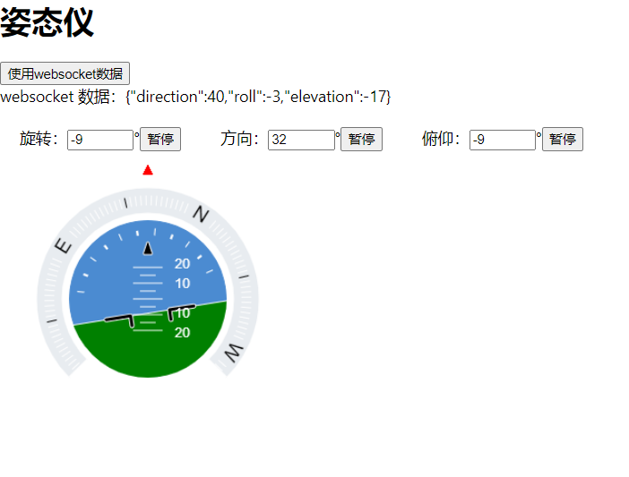
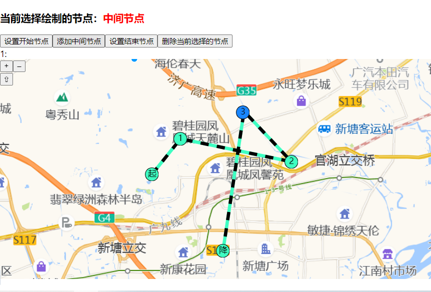

# 姿态仪
## 功能点
1. 使用canvas 绘制姿态仪
2. 包括3个指标：仰角、方向、旋转
3. 使用egg.js  实现后端服务，推送websocket数据
4. 使用外部数据控制姿态仪状态

# 地图航线绘制
## 功能点
1. 使用openlayers绘制地图和航线，使用高德地图作为数据源
2. 支持添加“起点”、“降点”、“中间节点”，并连成航线。
3. 上述节点可以删除，拖拽，选中节点变色。
   效果图
   

